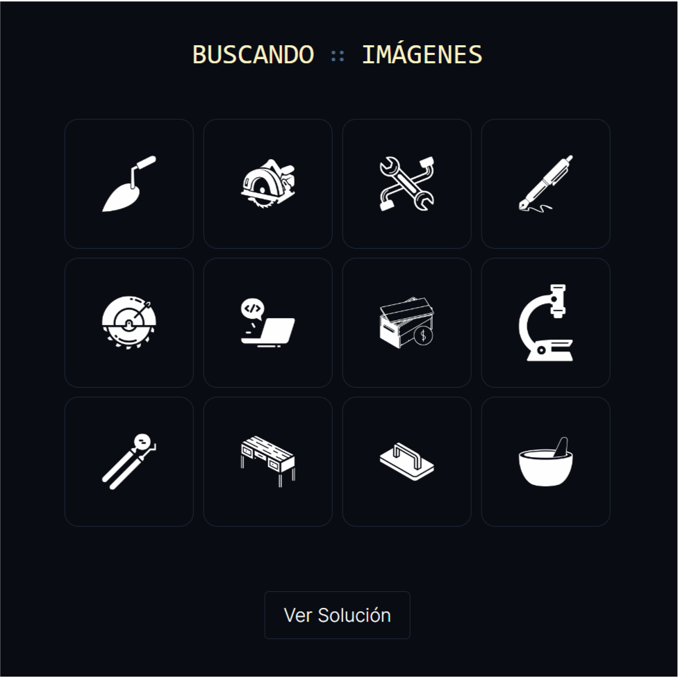
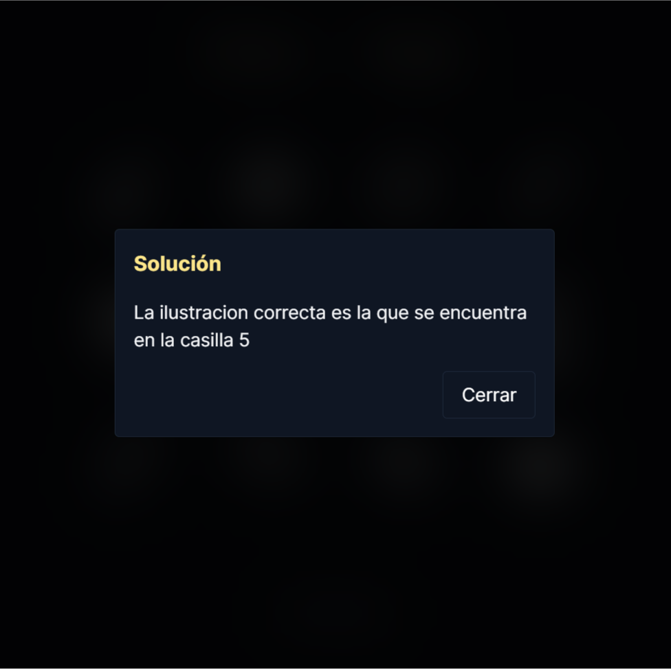
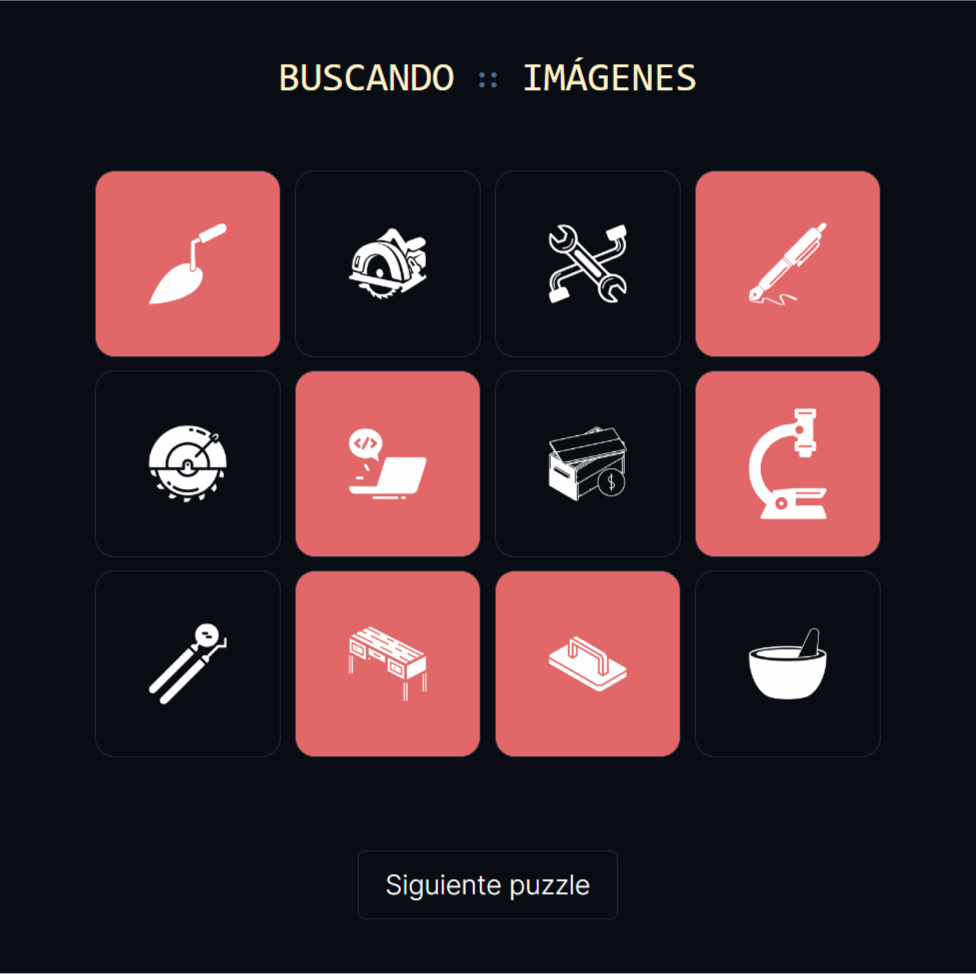
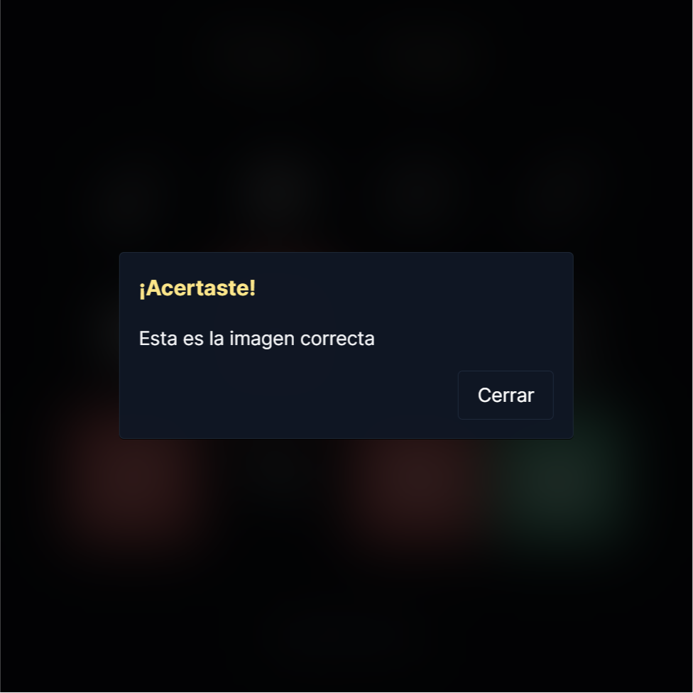
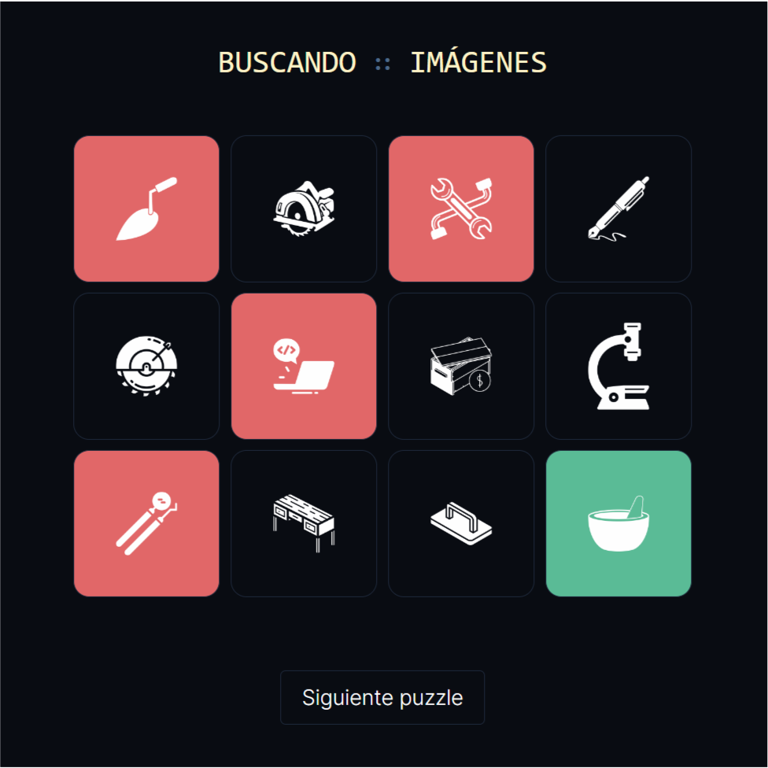

# BUSCANDO IMÁGENES

_Domingo, 23 de julio de 2024_

- npx create-next-app@latest

- Limpiamos el archivo `page.tsx`
- Dentro de la carpeta `src` creamos la carpeta `components` y dentro de esta, la carpeta `ui`
- Dentro de la carpeta `ui` creamos el archivo `Button.tsx`

## Instalación del paquete `clsx`

### `clsx` - Una utilidad para manejar clases de manera fácil en JavaScript

#### Características principales:

- **Simplicidad**: Facilita la combinación de clases condicionales sin necesidad de lógica compleja.
- **Flexibilidad**: Compatible con cualquier framework o biblioteca JavaScript.
- **Eficiencia**: Mínimo impacto en el rendimiento debido a su tamaño reducido.

#### Instalación

```bash
npm install clsx
```

```bash
yarn add clsx
```

---

## Instalación del paquete `tailwind-merge`

### `tailwind-merge` - Una utilidad para combinar clases de Tailwind CSS

#### Características principales:

- **Simplicidad**: Combina clases de Tailwind CSS de manera automática y sin esfuerzo.
- **Resolución de conflictos**: Elimina clases duplicadas y resuelve conflictos de estilos de manera inteligente.
- **Compatibilidad**: Funciona perfectamente con cualquier proyecto que utilice Tailwind CSS.

#### Instalación

```bash
npm install tailwind-merge
```

```bash
yarn add tailwind-merge
```

#

# BUSCANDO ∷ IMÁGENES

## Descripción

*BUSCANDO ∷ IMÁGENES* es una aplicación web interactiva donde los usuarios seleccionan imágenes de una cuadrícula para identificar la imagen correcta. Esta aplicación proporciona retroalimentación visual para selecciones correctas e incorrectas e incluye modales para información adicional y guía al usuario.

### Características

#### Generación Aleatoria de Número Correcto

- En cada nuevo juego, la aplicación genera un número aleatorio entre 1 y 12, que determina la imagen correcta que el usuario debe identificar.

#### Selección de Imágenes

- La interfaz principal consiste en una cuadrícula de 12 imágenes.
- Los usuarios hacen clic en una imagen para seleccionarla.

#### Mecanismo de Retroalimentación

- **Selección Correcta**:
  - Cuando el usuario selecciona la imagen correcta, aparece un modal con un mensaje de éxito.
  - Se muestra un botón "Siguiente Puzzle" para iniciar una nueva ronda.
- **Selección Incorrecta**:
  - Las selecciones incorrectas se marcan en rojo.
  - Después de 7 selecciones incorrectas, un modal informa al usuario que ha perdido y se inicia una nueva ronda.

### Modales para Información

- **Modal de Solución**:
  - Proporciona la ubicación correcta de la imagen cuando el usuario hace clic en "Ver Solución".
- **Modal de Correcto**:
  - Muestra un mensaje cuando se selecciona la imagen correcta.
- **Modal de Perdiste**:
  - Notifica al usuario que ha perdido después de 7 selecciones incorrectas.

---

## Capturas de Pantalla

A continuación se muestran algunas capturas de pantalla de la aplicación:

- **Pantalla de inicio**

  

- **Modal ver solucion**

  

- **Selecciones incorrectas**

  

- **Modal de imagen correcta**

  

  - **Pantalla de acierto**

  

#

Para más información, visita [www.hexagono.xyz](http://www.hexagono.xyz).

#
